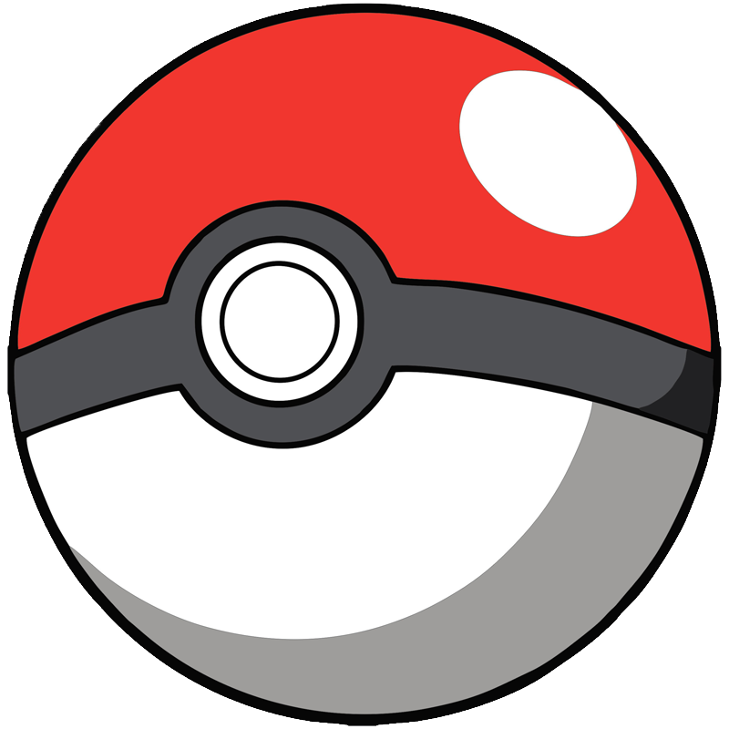
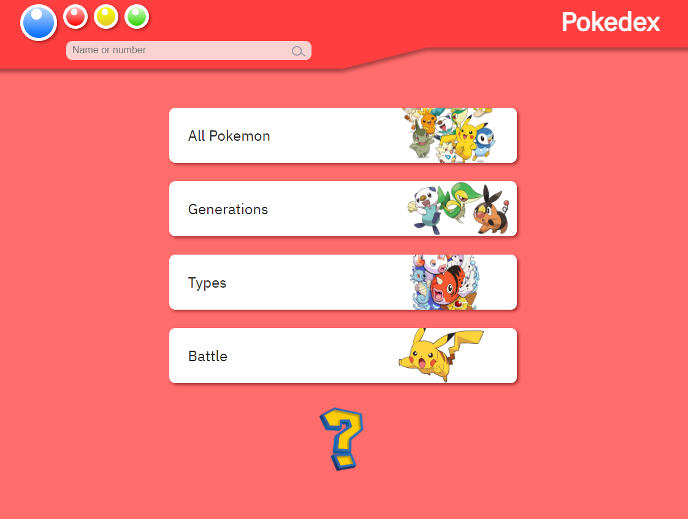
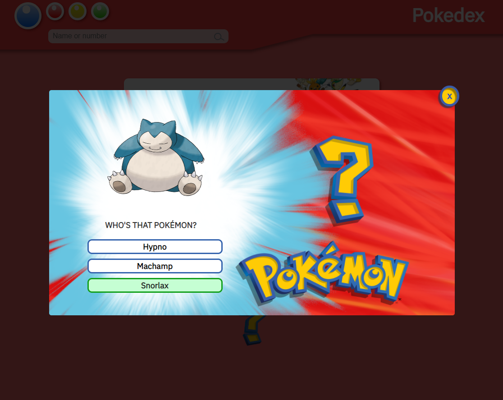
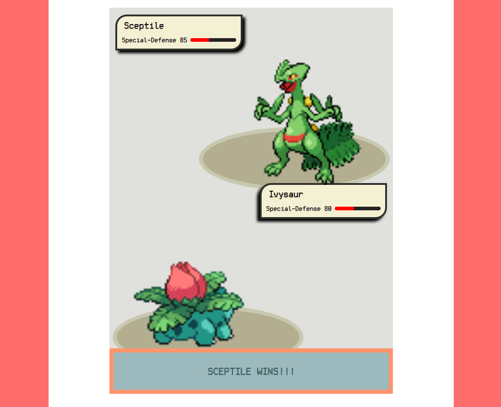

# Pokedex 

Projeto criado para estudo de Vue.js e requisições<br>
Além do Vue utilizo as tecnologias: JavaScipt, CSS e HTML.<br>
O consumo da API é feito através da: pokeapi.<br>
Protótipo criado no AdobeXD <br>

https://pokedexvuejs.netlify.app/

<div display="flex">
  
  
  
</div>

## Project setup

```
npm install
```

### Compiles and hot-reloads for development

```
npm run serve
```

### Compiles and minifies for production

```
npm run build
```

### Lints and fixes files

```
npm run lint
```

### Customize configuration

See [Configuration Reference](https://cli.vuejs.org/config/).
